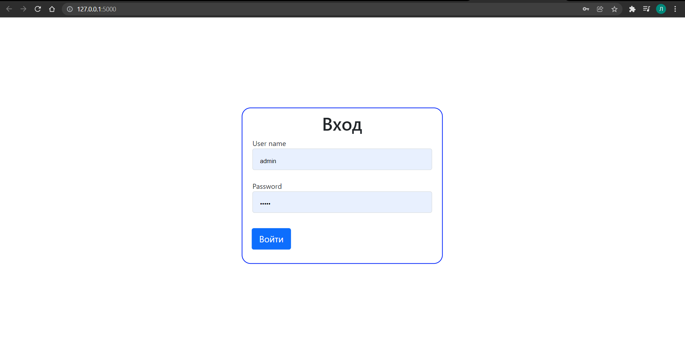
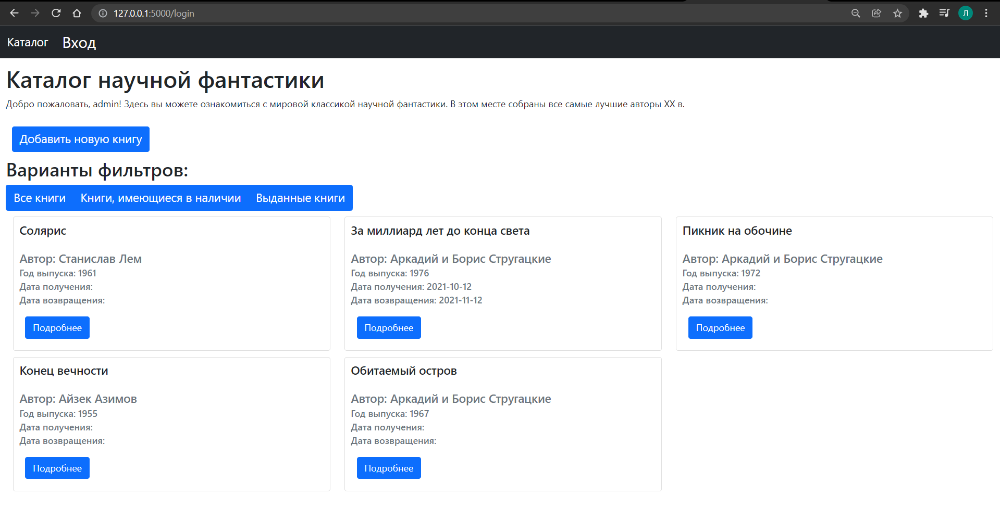
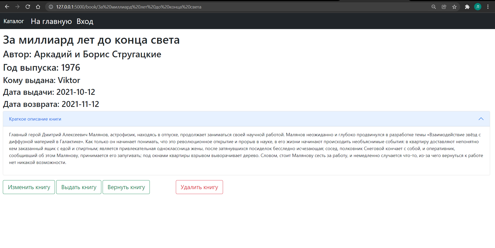

# "Каталог научной фантастики"
Простое веб-приложение, которое имеет следующий функционал:
1. Добавление книг в библиотеку
2. Удаление книг из библиотеки
3. Редактирование уже добавленных книг
4. Фильтрация выводимого списка книг

Данные о книгах в библиотеке хранятся в json-файле `books.json` в папке `json`.

Серверная часть написана на Flask. Необходимые зависимости для запуска приложения указаны в `requirements.txt`.

Клиентская часть содержит 3 html-страницы, стили, заданные с помощью **Bootstrap5**, а так же ajax-запрос для фильтрации книг без перезагрузки страницы.

# Скриншоты страниц приложения
## Страница авторизации:

## Главная страница:

## Страница подробной информации о книге:

